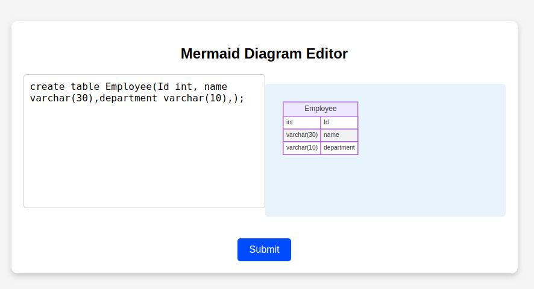

# SQL to Mermaid ER Diagram Generator

This project is a **work in progress** tool that parses SQL `CREATE TABLE` statements to extract table structure (table name, column names, and data types) and generates a corresponding **Mermaid ER diagram**. This can be useful for database documentation, visualization, or design purposes.

---

## Features
- Parses SQL `CREATE TABLE` queries.
- Extracts table names and column definitions (names and data types).
- Converts extracted information into a Mermaid ER diagram.
- Outputs diagrams compatible with Mermaid.js.

---

## Libraries Used
This project leverages the following Python libraries:
1. **[sqlparse](https://pypi.org/project/sqlparse/)**  
   - A non-validating SQL parser used to tokenize and analyze SQL queries.

---

## How to Use
1. Clone the repository:
   ```bash
   git clone <repository_url>
   cd sql-to-mermaid-er
   ```
2. Create and activate virtual environment.
    ```bash
    python3 -m venv venv
    source venv/bin/activate
    ```
3. Install the required library:
   ```bash
   pip install sqlparse, flask
   ```
4. Run the script:
   ```bash
   flask run
   ```
5. Your application will be running on localhost:5000/get-mermaid.


---

## Running Test Cases

3. Run the tests:
   ```bash
   pytest
   ```

---

## Screenshot
Below is an example of the program's output:



---

## Roadmap
- **Enhancements in Parsing Logic**: Support for more SQL features such as constraints, indexes, and foreign key relations.
- **Improved Error Handling**: Better handling of invalid or incomplete SQL queries.
- **Command-Line Tool**: Add CLI support to accept SQL files and generate Mermaid diagrams.
- **Integration with Mermaid Renderers**: Directly render diagrams as images or HTML files.

---

## Contribution
Contributions are welcome! If you'd like to improve this project:
1. Fork the repository.
2. Create a new branch for your feature or fix.
3. Submit a pull request.

---

## License
This project is licensed under the [MIT License]().